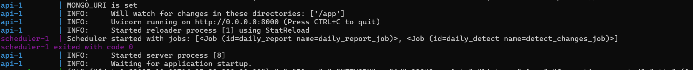
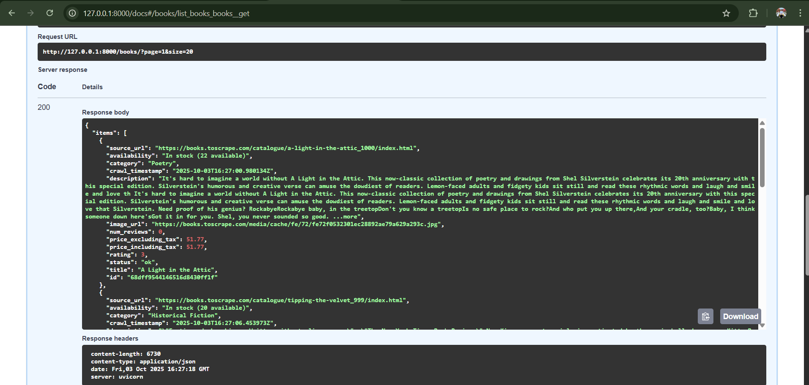
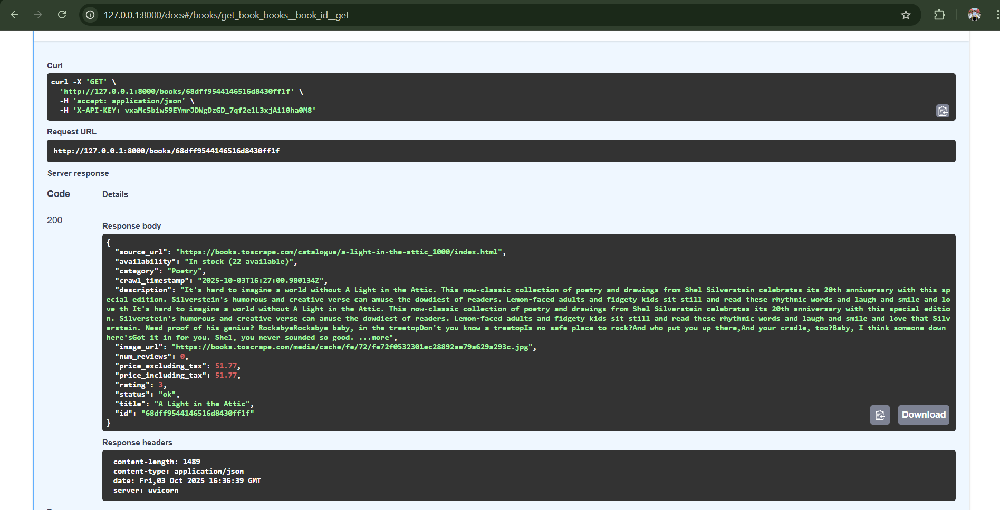
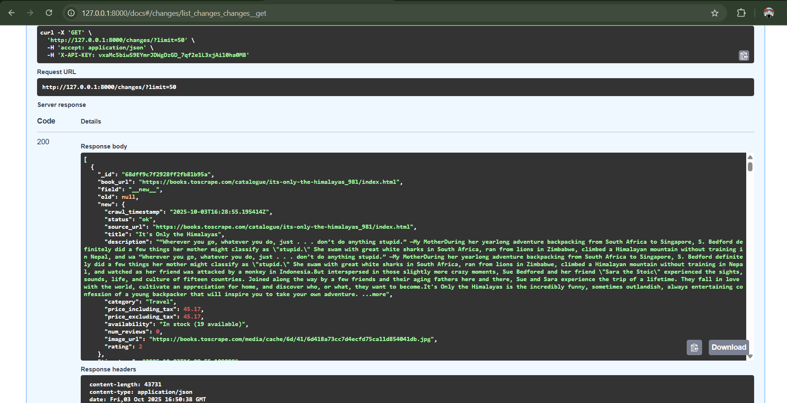

# FK Crawler

A production-ready, async Python project for crawling [books.toscrape.com](https://books.toscrape.com), detecting changes, and serving data via a FastAPI API with API-key authentication, rate limiting, and daily change reporting.

---
## Sample MongoDB Document Structures

### books Collection
```json
{
  "_id": "ObjectId",
  "crawl_timestamp": "2025-10-02T12:34:56.789Z",
  "status": "ok",
  "source_url": "https://books.toscrape.com/catalogue/a-light-in-the-attic_1000/index.html",
  "title": "A Light in the Attic",
  "description": "A collection of poems...",
  "category": "Poetry",
  "price_including_tax": 51.77,
  "price_excluding_tax": 51.77,
  "availability": "In stock (22 available)",
  "num_reviews": 0,
  "image_url": "https://books.toscrape.com/media/cache/xx/a-light-in-the-attic.jpg",
  "rating": 3
}
```

### change_log Collection
```json
{
	"_id": "ObjectId",
	"book_url": "https://books.toscrape.com/catalogue/a-light-in-the-attic_1000/index.html",
	"field": "price_including_tax",
	"old": 51.77,
	"new": 45.00,
	"timestamp": "2025-10-02T13:00:00.000Z"
}
```

### crawl_progress Collection
```json
{
  "_id": "ObjectId",
  "source_url": "https://books.toscrape.com/catalogue/a-light-in-the-attic_1000/index.html"
}
```
---

## Features

- **Async crawling** with httpx and BeautifulSoup
- **MongoDB** storage for books, change logs, and logs
- **Change detection** (price, availability, etc.) and logging
- **API** for querying books and changes, with filtering, sorting, and pagination
- **API key authentication** and **rate limiting** (100 requests/hour)
- **Daily scheduler** for crawling and change reporting (celery beat)
- **Email alerts** for new books and significant changes
- **Daily CSV report** of changes sent to admin
- **OpenAPI/Swagger docs** at `/docs`
- **Dockerized** for easy deployment

---

## Project Structure

```
src/
	api/         # FastAPI app, routes, security
	crawler/     # Scraper, diff logic, schema
	db/          # MongoDB async wrapper
	scheduler/   # APScheduler jobs, daily report
	utils/       # Logging, alerting, helpers
	tests/       # Pytest tests
```

---

## Setup Instructions

### 1. Prerequisites

- Python 3.11+
- Docker & Docker Compose (recommended for local/dev)
- MongoDB (runs as a container by default)

### 2. Clone the repository
	```sh
	git clone https://github.com/mdparvex/Crawling-Project.git
	cd Crawling-Project/fk-crawler
	```

### 3. Configuration

Copy `.env.example` to `.env` and fill in your secrets and settings:

```env
MONGO_URI=mongodb://mongo:27017/fk_crawler
MONGO_DB=fk_crawler
API_KEY=your_api_key_here
CRAWL_CONCURRENCY=10
CRAWL_TIMEOUT=20
RATE_LIMIT=100/hour
BASE_URL=https://books.toscrape.com
SMTP_HOST=smtp.example.com
SMTP_PORT=587
SMTP_USER=your_email@example.com
SMTP_PASS=your_password
ALERT_EMAIL_TO=admin@example.com
ALERT_EMAIL_FROM=your_email@example.com
```

### 4. Build & Run (Docker)

```sh
docker-compose up --build
```

- API: http://localhost:8000 (docs at `/docs`)
- MongoDB: localhost:27017

### 5. Manual Crawl (optional)

```sh
python -m src.crawler.main
```

---

## API Overview

- **GET /books**  
	List books with filters: `category`, `min_price`, `max_price`, `rating`, `sort_by`, `page`, `size`
- **GET /books/{book_id}**  
	Get full details for a book
- **GET /changes**  
	View recent changes (price, new books, etc.)

All endpoints require `X-API-KEY` header.

---


## Development & Testing


### Running Tests

- Run all tests:
	```sh
	pytest src/tests/
	```
- Example test file: `src/tests/test_api.py` covers API endpoints for `/books`, `/books/{book_id}`, and `/changes`.

---

## API Documentation & Example Responses

Interactive API docs are available at: [http://localhost:8000/docs](http://localhost:8000/docs)

### GET /books

**Description:** List books with filters and pagination.

**Query Parameters:**
- `category`, `min_price`, `max_price`, `rating`, `sort_by`, `page`, `size`

**Response Example:**
```json
{
	"items": [
		{
			"id": "651b2c7e8f1b2a001e7e7e7e",
			"crawl_timestamp": "2025-10-02T12:34:56.789Z",
			"status": "ok",
			"source_url": "https://books.toscrape.com/catalogue/a-light-in-the-attic_1000/index.html",
			"title": "A Light in the Attic",
			"description": "A collection of poems...",
			"category": "Poetry",
			"price_including_tax": 51.77,
			"price_excluding_tax": 51.77,
			"availability": "In stock (22 available)",
			"num_reviews": 0,
			"image_url": "https://books.toscrape.com/media/cache/xx/a-light-in-the-attic.jpg",
			"rating": 3
		}
	],
	"page": 1,
	"size": 20
}
```

### GET /books/{book_id}

**Description:** Get full details for a book by its ID.

**Response Example:**
```json
{
	"id": "651b2c7e8f1b2a001e7e7e7e",
	"crawl_timestamp": "2025-10-02T12:34:56.789Z",
	"status": "ok",
	"source_url": "https://books.toscrape.com/catalogue/a-light-in-the-attic_1000/index.html",
	"title": "A Light in the Attic",
	"description": "A collection of poems...",
	"category": "Poetry",
	"price_including_tax": 51.77,
	"price_excluding_tax": 51.77,
	"availability": "In stock (22 available)",
	"num_reviews": 0,
	"image_url": "https://books.toscrape.com/media/cache/xx/a-light-in-the-attic.jpg",
	"rating": 3
}
```

### GET /changes

**Description:** View recent changes (price, new books, etc.)

**Response Example:**
```json
[
	{
		"_id": "651b2c7e8f1b2a001e7e7e7f",
		"book_url": "https://books.toscrape.com/catalogue/a-light-in-the-attic_1000/index.html",
		"field": "price_including_tax",
		"old": 51.77,
		"new": 45.00,
		"timestamp": "2025-10-02T13:00:00.000Z"
	}
]
```

---

# Screen soot

### Schedulars are running properly


---

### Mail sending properly when New books are added


---
# sample response
### GET /books/?


---
### GET /books/{book_id}


---
### GET /changes/?limit=50

